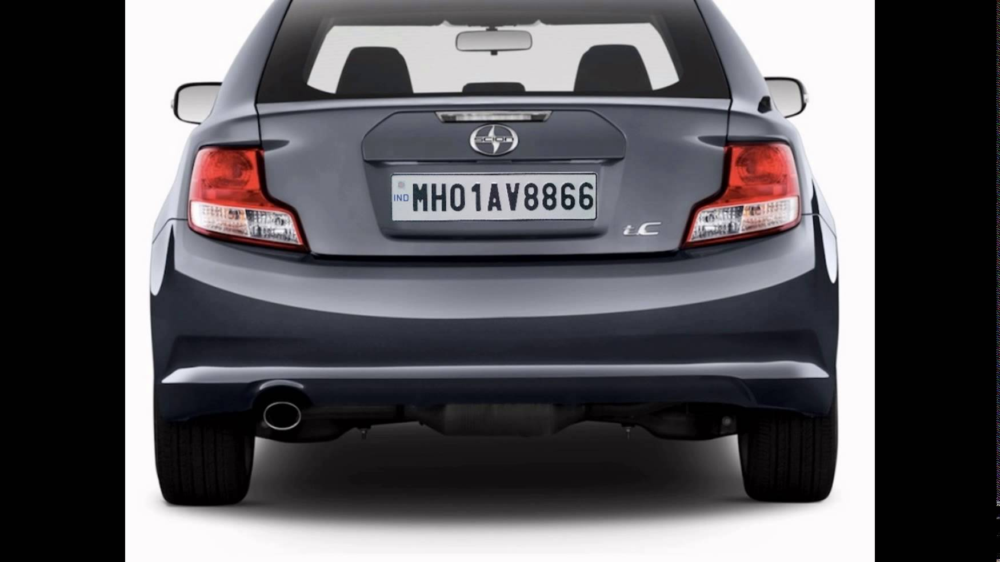
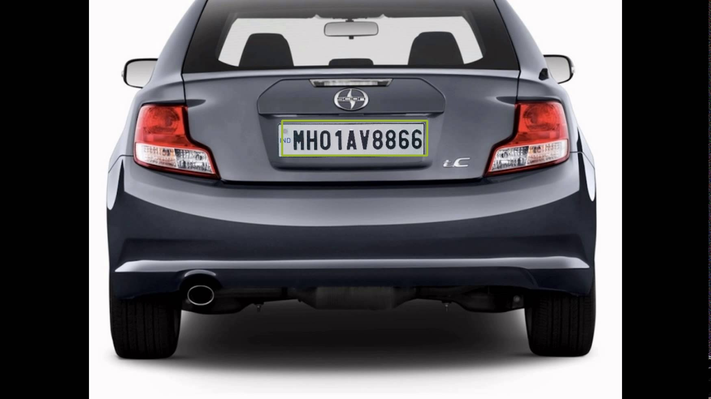
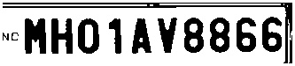
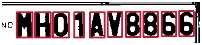
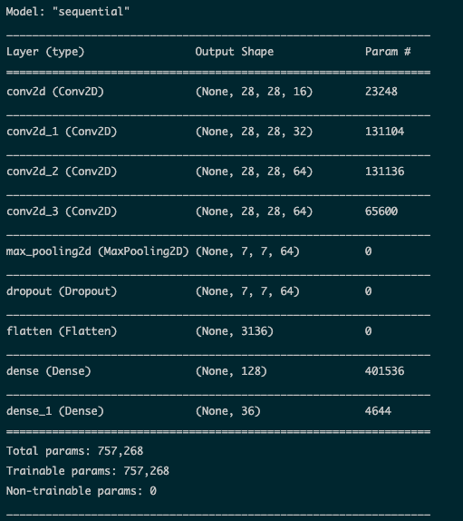

# CV Logic

## Виявлення номерного знака

### def detect_plate(img, text=''):

* Дана функція бере вхідне зображення та, використовуючи ‘haar cascade’, виявляє номерні знаки та повертає координати та розміри контурів виявленого номерного знаку.

* Параметр scaleFactor означає значення, за допомогою якого вхідне зображення можна масштабувати для кращого виявлення номерного знаку.

* minNeighbors - це просто параметр для зменшення помилкових спрацьовувань, якщо це значення низьке, алгоритм може бути більш схильним давати неправильно розпізнані результати. 

Before             |  After
:-------------------------:|:-------------------------:
 | 

## Обробка зображення на номерному знаку

###  def segment_characters(image):

Дана функція бере зображення як вхідне і виконує над ним наступні операції:

* змінює розмір на такий вимір, щоб усі символи здавалися чіткими та відділеними один від одного

* перетворити кольорове зображення в масштабоване зображення сірого кольору, тобто замість 3 каналів (BGR), зображення має лише один 8-розрядний канал зі значеннями від 0 до 255, де 0 відповідає чорному, а 255-білому. Ми робимо це, щоб підготувати зображення до наступного процесу

* тепер порогова функція перетворює масштабоване зображення сірого кольору у двійкове зображення, тобто кожен піксель тепер матиме значення 0 або 1, де 0 відповідає чорному, а 1 відповідає білому. Це робиться шляхом застосування порогу, який має значення від 0 до 255, тут значення 200, що означає у зображенні у градаціях сірого для пікселів зі значенням вище 200, у новому двійковому зображенні пікселю буде надано значення 1. А для пікселів зі значенням нижче 200 у новому двійковому зображенні цьому пікселю буде надано значення 0

* Зображення тепер у двійковому вигляді та готове до наступного процесу  Eroding. Eroding - це простий процес, який використовується для видалення небажаних пікселів з межі об’єкта, тобто пікселі, які мають мати значення 0, але мають значення 1. Він працює, враховуючи кожен піксель на зображенні по одному, а потім враховуючи сусіда пікселя ( кількість сусідів залежить від розміру ядра), пікселю надається значення 1, тільки якщо всі його сусідні пікселі дорівнюють 1, інакше йому надається значення 0

* Зображення тепер чисте та без меж, ми тепер розширимо зображення, щоб заповнити відсутні пікселі, тобто пікселі, які повинні мати значення 1, але мають значення 0. Функція працює подібно до Eroding, але з невеликим уловлюванням, це працює, розглядаючи кожен піксель на зображенні по одному, а потім враховуючи сусіда пікселя (кількість сусідів залежить від розміру ядра), пікселю надається значення 1, якщо хоча б один із сусідніх пікселів дорівнює 1

* Наступний крок - зробити межі зображення білими. Це потрібно для видалення будь -якого пікселя кадру у разі його наявності.

Before             |  After
:-------------------------:|:-------------------------:
 | 

## Сегментування символів з номерного знаку

### def find_contours(dimensions, img):

Дана функція застосовує наступні кроки для вилучення окремих символів з номерного знаку:

* Знайдіть усі контури у вхідному зображенні. Функція cv2.findContours повертає всі контури, які вона знаходить на зображенні. Контури можна пояснити просто як криву, що з'єднує всі безперервні точки (вздовж кордону), мають однаковий колір або інтенсивність 

* Знайшовши всі контури, ми розглядаємо їх по черзі та обчислюємо розміри відповідного обмежувального прямокутника. Тепер розглянемо обмежуючий прямокутник - найменший можливий прямокутник, який містить контур

* Оскільки у нас є розміри цих обмежувальних прямокутників, все, що нам потрібно зробити, це налаштувати параметри та відфільтрувати потрібний прямокутник, що містить необхідні символи. Для цього ми будемо виконувати деяке порівняння розмірів, приймаючи лише ті прямокутники, які мають ширину в діапазоні 0 - (довжина картинки)/(кількість символів) і довжину в діапазоні (ширина картинки)/ 2 - 4*(ширина картинки)/5.

Before             |  After
:-------------------------:|:-------------------------:
 | 

## Створення моделі машинного навчання та її тренування 

* Для моделювання ми будемо використовувати згорткову нейронну мережу з 6 слоями.

* Щоб модель була простою, ми почнемо зі створення послідовної моделі Sequential

* Перший шар буде згортковим шаром з 16 вихідними фільтрами, вікном згортки розміром (22,22) та "Relu" як функцією активації

* Другий шар буде згортковим шаром з 32 вихідними фільтрами, вікном згортки розміром (16,16) та "Relu" як функцією активації

* Третій шар буде згортковим шаром з 64 вихідними фільтрами, вікном згортки розміром (8,8) та "Relu" як функцією активації

* Четвертий шар буде згортковим шаром з 64 вихідними фільтрами, вікном згортки розміром (4,4) та "Relu" як функцією активації 

* Далі ми додамо шар максимального об’єднання з розміром вікна (4,4). Максимальне об'єднання-це процес дискретизації на основі вибірки. Мета полягає у зменшенні вибірки подання вхідних даних (зображення, вихідна матриця прихованого шару тощо), зменшення її розмірності та дозволяючи робити припущення щодо особливостей, що містяться у підрегіонах, що залучені

* Тепер ми додамо drop out, щоб подбати про надмірне оснащення.Drop out - це гіперпараметр регуляризації, ініціалізований для запобігання надмірному налагодженню нейронних мереж. Drop out - це техніка, де випадково вибрані нейрони ігноруються під час навчання. Ми вибрали коефіцієнт 0.4, що означає, що 60% вузла буде збережено

* Додаємо шар Flatten. Він бере дані з попереднього шару і представляє їх в одному вимірі

* Нарешті, ми додамо 2 щільні шари, один з розмірами вихідного простору як 128, функція активації = 'relu' та інший, наш останній шар з 36 виходами для класифікації 26 алфавітів (AZ) + 10 цифр (0– 9) та функція активації = 'softmax' 